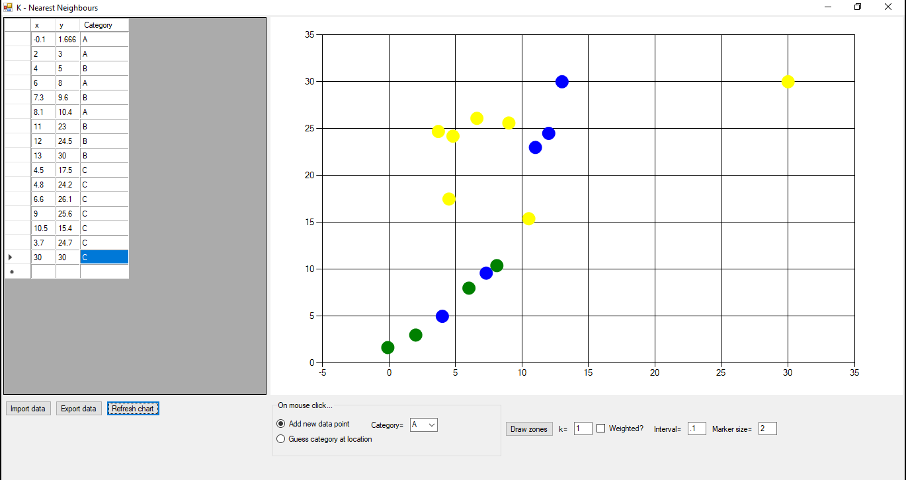
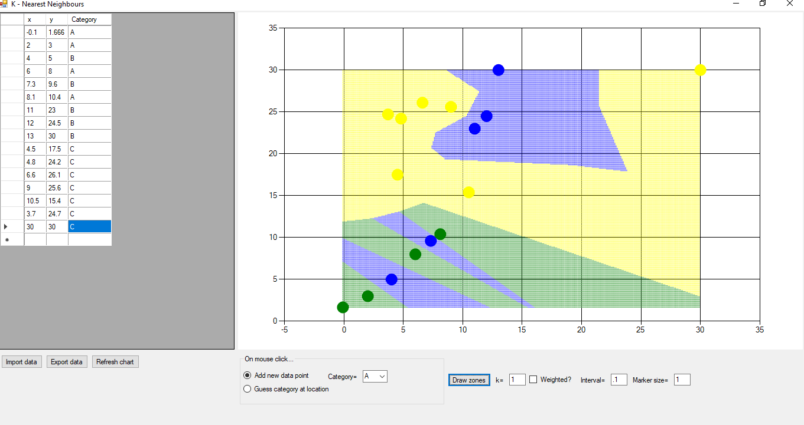

# Name
knn (K-nearest neighbours)

# Description
This program takes a set of points from a CSV file, plots it as a scatter plot, and allows the user to plot the KNN zones based on that set of data.

# Technology
Winforms with C#

# Sample Output

## Display of original data points

## Display of calculated category zones

# Button Actions

## Import data
When pressed, the user is requested for a CSV file. When supplied, the file is opened, the data is displayed in the LH panel, and a chart is displayed in the RH panel. 
This chart displays the data points found in the file, and colors them based on the category field, as follows:
* A=Green
* B=Blue
* C=Yellow

Every row in the CSV file has the first 3 columns as follows:
* X co-ordinate 
* Y co-ordinate
* Category (Either "A", "B", or "C" only)

## Export data
When pressed, the user is requested for a CSV file. When supplied, the data shown in the LH panel is written to that file.

## Refresh chart
The user is able to update the data in the LH panel at any time. However, the chart is not automatically updated. 
Pressing the "Refresh chart" button causes the program to reread the data and redisplay the chart.

## Draw zones
When pressed, a matrix of points within the bounding rectangle of the original data is created. 
The guessed category at each of this points is determined and displayed as a small rectangle, using the color assignment of the original data.
This produces a set of colored KNN zones.
The spacing and sizing of the squares can be modified by the user via the "Interval" and "Marker size" fields.

# Other Actions

## Clicking on a location in the chart
The result of this action depends upon the radio button selection within the "On mouse click..." group box.
* If the user has selected "Add new data point", then a data point with the current mouse co-ordinates will be automatically added to the grid in the LH side, and the chart refreshed.
* If the user has selected "Guess category at location", then a small square is displayed (size specified by the "Marker size" field) at the given location, displaying the color of the guessed category. The location is not added to the data on the LH side and the square will disappear if the chart is refreshed.